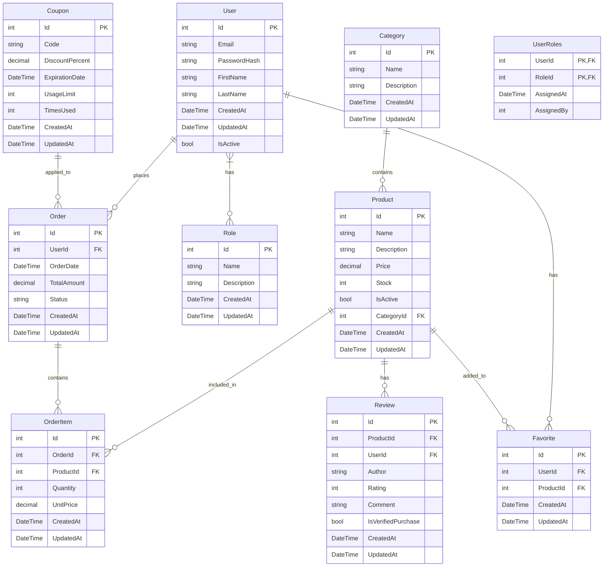

# Архитектурный план для настройки Entity Framework Core в проекте интернет-магазина

## 1. Структура моделей данных

### Пользователь (User)
- Id (int, первичный ключ)
- Email (string, уникальный, обязательный)
- PasswordHash (string, обязательный)
- FirstName (string, обязательный)
- LastName (string, обязательный)
- CreatedAt (DateTime, обязательный)
- UpdatedAt (DateTime, обязательный)
- IsActive (bool, обязательный, по умолчанию true)

### Роль (Role)
- Id (int, первичный ключ)
- Name (string, обязательный, уникальный)
- Description (string)
- CreatedAt (DateTime, обязательный)
- UpdatedAt (DateTime, обязательный)

### Продукт (Product)
- Id (int, первичный ключ)
- Name (string, обязательный)
- Description (string, обязательный)
- Price (decimal, обязательный)
- Stock (int, обязательный)
- IsActive (bool, обязательный, по умолчанию true)
- CategoryId (int, внешний ключ)
- CreatedAt (DateTime, обязательный)
- UpdatedAt (DateTime, обязательный)

### Категория (Category)
- Id (int, первичный ключ)
- Name (string, обязательный, уникальный)
- Description (string)
- CreatedAt (DateTime, обязательный)
- UpdatedAt (DateTime, обязательный)

### Заказ (Order)
- Id (int, первичный ключ)
- UserId (int, внешний ключ)
- OrderDate (DateTime, обязательный)
- TotalAmount (decimal, обязательный)
- Status (string, обязательный)
- CreatedAt (DateTime, обязательный)
- UpdatedAt (DateTime, обязательный)

### Элемент заказа (OrderItem)
- Id (int, первичный ключ)
- OrderId (int, внешний ключ)
- ProductId (int, внешний ключ)
- Quantity (int, обязательный)
- UnitPrice (decimal, обязательный)
- CreatedAt (DateTime, обязательный)
- UpdatedAt (DateTime, обязательный)

### Отзыв (Review)
- Id (int, первичный ключ)
- ProductId (int, внешний ключ)
- UserId (int, внешний ключ, nullable)
- Author (string, обязательный)
- Rating (int, обязательный, 1-5)
- Comment (string, обязательный)
- IsVerifiedPurchase (bool, обязательный)
- CreatedAt (DateTime, обязательный)
- UpdatedAt (DateTime, обязательный)

### Купон (Coupon)
- Id (int, первичный ключ)
- Code (string, обязательный, уникальный)
- DiscountPercent (decimal, обязательный)
- ExpirationDate (DateTime, обязательный)
- UsageLimit (int, nullable)
- TimesUsed (int, обязательный, по умолчанию 0)
- CreatedAt (DateTime, обязательный)
- UpdatedAt (DateTime, обязательный)

### Избранное (Favorite)
- Id (int, первичный ключ)
- UserId (int, внешний ключ)
- ProductId (int, внешний ключ)
- CreatedAt (DateTime, обязательный)
- UpdatedAt (DateTime, обязательный)

## 2. Связи между таблицами

### One-to-Many связи:
- Пользователь → Заказы
- Категория → Продукты
- Продукт → Отзывы

### Many-to-Many связи:
- Пользователь ↔ Роли (через таблицу UserRoles)
- Пользователь ↔ Избранное

### Связи с промежуточными таблицами:

#### UserRoles (промежуточная таблица для связи Пользователь ↔ Роли)
- UserId (int, внешний ключ на User)
- RoleId (int, внешний ключ на Role)
- AssignedAt (DateTime, обязательный)
- AssignedBy (int, внешний ключ на User, nullable)

## 3. Конфигурация Fluent API

### Пользователь (User)
- Первичный ключ: Id
- Уникальный индекс: Email
- Обязательные поля: Email, PasswordHash, FirstName, LastName, CreatedAt, UpdatedAt, IsActive
- Максимальная длина: Email (255), FirstName (50), LastName (50)
- Значение по умолчанию: IsActive = true
- Настройка поведения при удалении: Cascade для связей с Favorite

### Роль (Role)
- Первичный ключ: Id
- Уникальный индекс: Name
- Обязательные поля: Name, CreatedAt, UpdatedAt
- Максимальная длина: Name (50), Description (255)

### Продукт (Product)
- Первичный ключ: Id
- Обязательные поля: Name, Description, Price, Stock, IsActive, CategoryId, CreatedAt, UpdatedAt
- Максимальная длина: Name (100), Description (500)
- Точность: Price (18,2)
- Значение по умолчанию: IsActive = true
- Настройка поведения при удалении: Restrict для связи с Category, Cascade для связи с Review

### Категория (Category)
- Первичный ключ: Id
- Уникальный индекс: Name
- Обязательные поля: Name, CreatedAt, UpdatedAt
- Максимальная длина: Name (50), Description (255)
- Настройка поведения при удалении: Restrict для связи с Product

### Заказ (Order)
- Первичный ключ: Id
- Обязательные поля: UserId, OrderDate, TotalAmount, Status, CreatedAt, UpdatedAt
- Максимальная длина: Status (20)
- Точность: TotalAmount (18,2)
- Настройка поведения при удалении: Restrict для связи с User

### Элемент заказа (OrderItem)
- Первичный ключ: Id
- Обязательные поля: OrderId, ProductId, Quantity, UnitPrice, CreatedAt, UpdatedAt
- Точность: UnitPrice (18,2)
- Настройка поведения при удалении: Cascade для связи с Order и Product

### Отзыв (Review)
- Первичный ключ: Id
- Обязательные поля: ProductId, Author, Rating, Comment, IsVerifiedPurchase, CreatedAt, UpdatedAt
- Максимальная длина: Author (50), Comment (1000)
- Ограничения: Rating (1-5)
- Настройка поведения при удалении: Cascade для связи с Product

### Купон (Coupon)
- Первичный ключ: Id
- Уникальный индекс: Code
- Обязательные поля: Code, DiscountPercent, ExpirationDate, TimesUsed, CreatedAt, UpdatedAt
- Максимальная длина: Code (20)
- Точность: DiscountPercent (5,2)

### Избранное (Favorite)
- Первичный ключ: Id
- Обязательные поля: UserId, ProductId, CreatedAt, UpdatedAt
- Составной уникальный индекс: UserId + ProductId
- Настройка поведения при удалении: Cascade для связи с User

### UserRoles (промежуточная таблица)
- Составной первичный ключ: UserId + RoleId
- Обязательные поля: UserId, RoleId, AssignedAt
- Внешние ключи: UserId → User(Id), RoleId → Role(Id)
- Настройка поведения при удалении: Restrict для связей с User и Role

## 4. Требования к реализации

1. Все связи настраиваются через Fluent API
2. Не использовать Data Annotations
3. Явные промежуточные таблицы для Many-to-Many связей с дополнительными полями
4. Настройка поведения при удалении:
   - Пользователь → Заказы: Restrict
   - Категория → Продукты: Restrict
   - Продукт → Отзывы: Cascade
   - Пользователь ↔ Роли: Restrict
   - Пользователь ↔ Избранное: Cascade
5. Seed данные для ролей и тестовых пользователей:
   - Роли: "Администратор", "Пользователь", "Модератор"
   - Тестовые пользователи: администратор (admin@test.com) и обычный пользователь (user@test.com)
6. Все цены хранятся с точностью (18,2)
7. Все даты хранятся в формате UTC
8. Все строковые поля имеют ограничения по длине
9. Все обязательные поля помечены как IsRequired()
10. Уникальные индексы для полей, которые должны быть уникальными

## 5. Диаграмма архитектуры

## 6. Рекомендации по реализации

1. Создать отдельный DbContext для интернет-магазина
2. Реализовать все модели как отдельные классы
3. Создать отдельный класс для конфигурации каждой модели с использованием Fluent API
4. Использовать миграции Entity Framework Core для создания и обновления базы данных
5. Реализовать seed данных через метод Seed в DbContext или отдельный сервис
6. Настроить dependency injection для DbContext в Startup.cs или Program.cs
7. Использовать репозитории для доступа к данным, если это соответствует архитектуре проекта